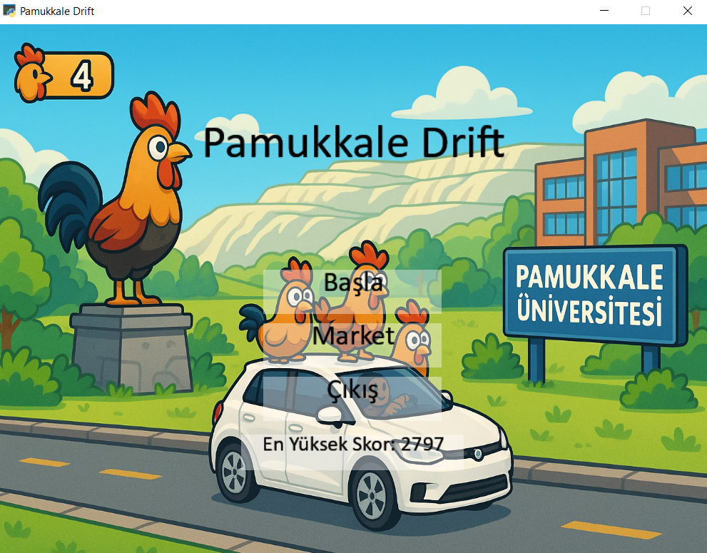
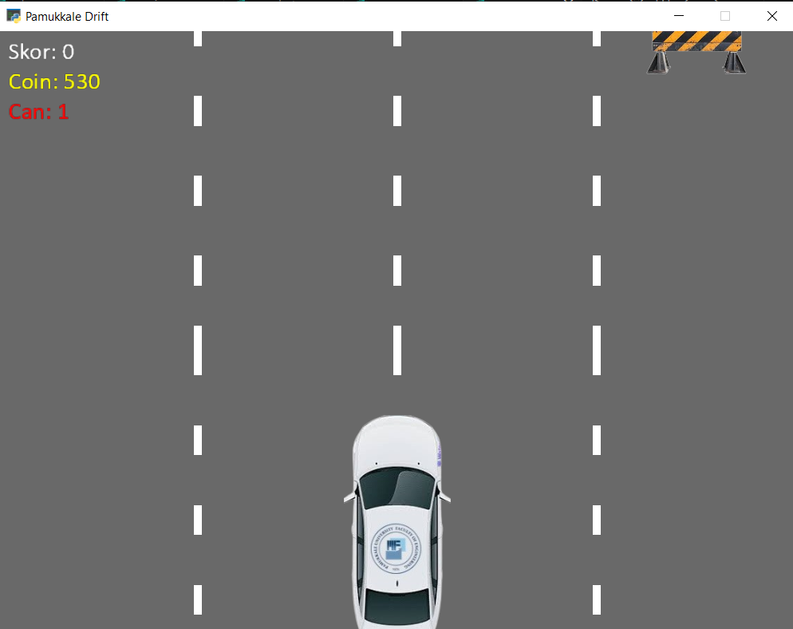
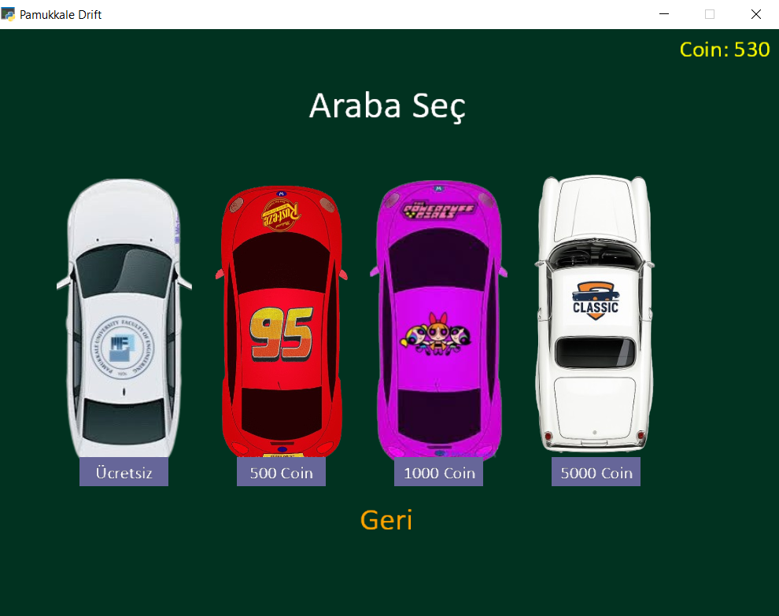
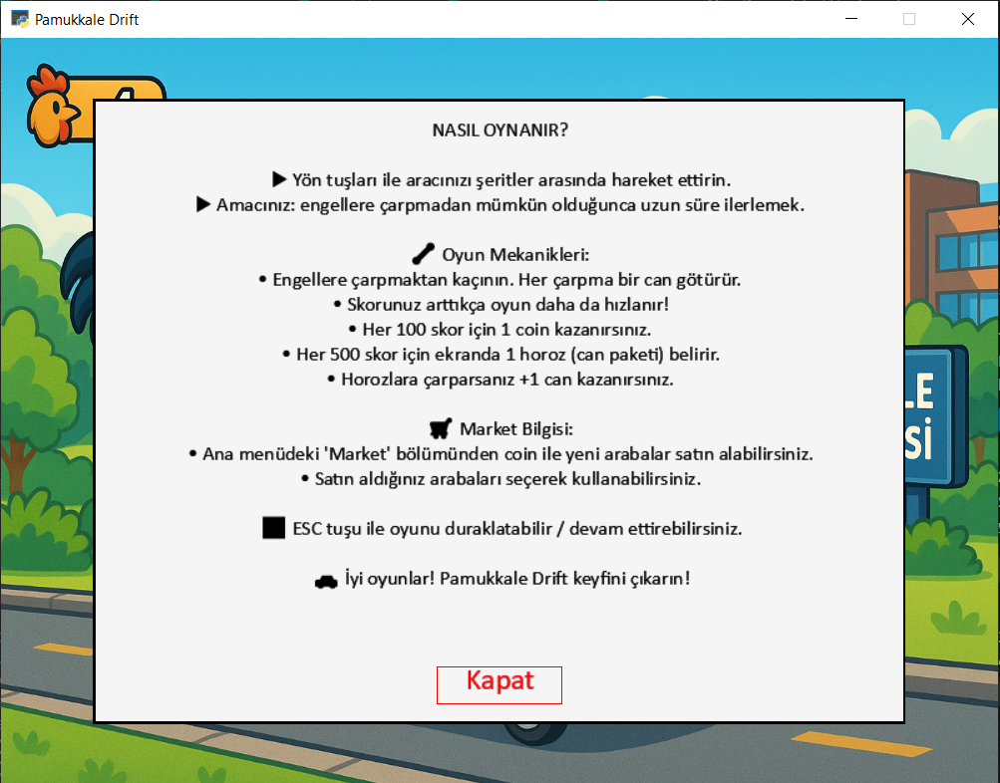
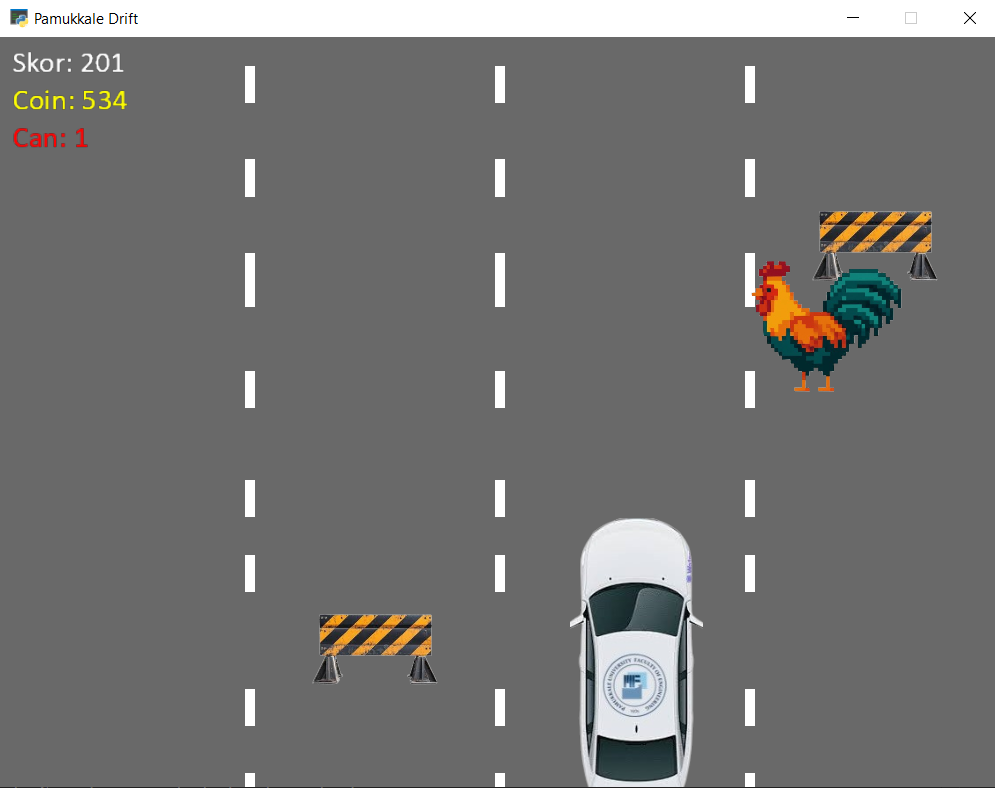

# 🚗 Pamukkale Drift

Pamukkale Drift, Python ve Arcade kütüphanesiyle geliştirilen 2 boyutlu bir araba yarışı oyunudur. Oyuncular şerit değiştirerek engellerden kaçmalı, can paketlerini toplamalı ve marketten yeni arabalar satın almalıdır.

## 🎮 Oyun Özellikleri

- 4 şeritli drift parkuru
- Engel çarpışma ve can sistemi
- Coin ile çalışan market
- Farklı araba seçenekleri
- Müzik ve ses efektleri
- Yüksek skor kaydı
- “Nasıl Oynanır?” ekranı
- Animasyonlu horoz can paketi 🐓

## 📸 Oyun Görselleri

### Ana Menü Ekranı


### Oyun İçi Ekran


### Market


### Nasıl Oynanır?


### Animasyon 


---

## 🕹️ Nasıl Oynanır?

- **Sağ/Sol ok tuşları:** Şerit değiştir
- **Can paketini topla:** +1 can
- **Engele çarparsan:** Can kaybedersin
- **Market:** Coin biriktirerek yeni araçlar satın al

---

## 🛠️ Kurulum

### 1. Gereken Paketler:

```bash
pip install arcade

## 👩‍💻 Geliştiriciler

- Begüm Sıla Taşcı
- Aysenur Pak


